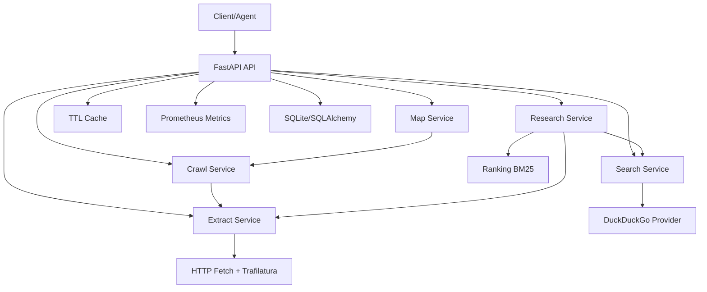

# WISP Architecture

## TODO (Future Enhancements)
- Optional local embeddings reranker toggle with sentence-transformers.
- Pluggable providers for SearXNG and Brave-compatible local gateways.
- Async queue-backed crawl workers and checkpoint resume.
- Richer contradiction detection and claim-level provenance alignment.
